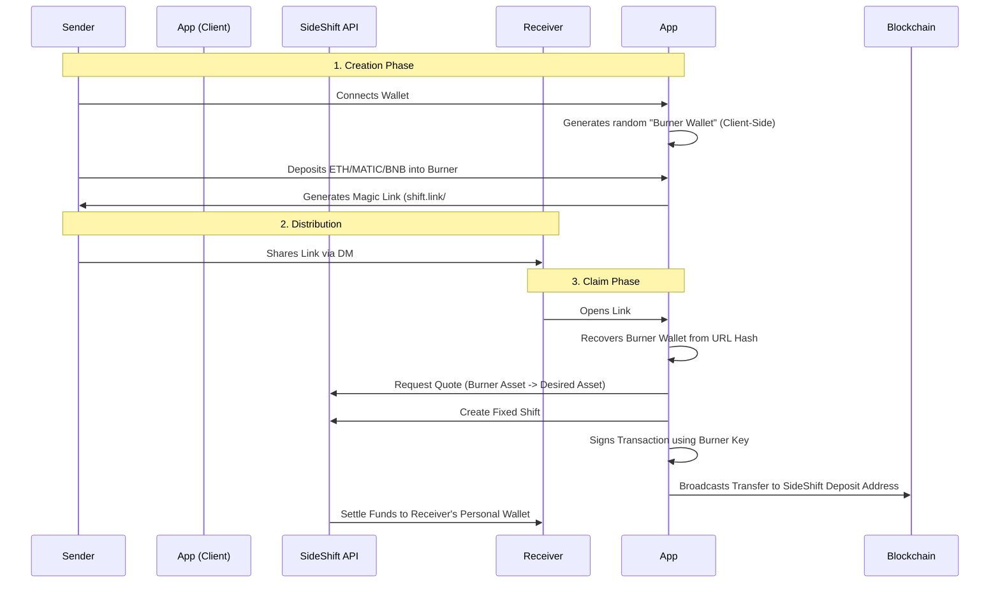

# ShiftLink 🔗

<div align="center">
  
  <br />
  <br />

  [](https://sideshift.ai)
  [](https://sideshift.ai)
  [](https://nextjs.org)
  [](https://tailwindcss.com)
  
  <h3 align="center">The "Venmo" for Cross-Chain Crypto.</h3>
  <p align="center">
    Send crypto to <b>anyone</b>, on <b>any chain</b>, via a simple link.<br/>
    The receiver pays <b>ZERO GAS</b> and needs <b>ZERO WALLET SETUP</b> to claim.
  </p>
</div>

---

## 🚨 The Problem
Crypto payments are broken for normies.
1.  **"What's your address?"** (Confusion between ETH/SOL/BTC addresses)
2.  **"Which network?"** (Sending USDT on Arb to a user on Poly = Lost funds)
3.  **"I don't have gas."** (Receiver has USDT but no ETH to move it)

## 💡 The ShiftLink Solution
**ShiftLink** creates a **"Magic Link"** that contains the funds. You send the link via WhatsApp, Telegram, or Email.
The receiver opens it, connects *any* wallet (or just pastes an address), and the funds are **swapped & bridged** to their desired destination automatically.

### ✨ Key Features
*   **⛽ Zero Gas for Receiver:** The sender pre-pays the gas in the "Burner Wallet". The claim transaction is broadcasted by the app using the burner's key.
*   **⚡ Instant Settlement:** Powered by **SideShift.ai** for 2-second quotes and rapid bridging.
*   **🔐 Client-Side Security:** The "Burner Key" is generated in the browser and embedded in the URL hash (`#k=...`). **It is NEVER sent to our servers.**
*   **🌐 Multi-Chain:** Send ETH (Base), Receive SOL (Solana). Complete freedom.

---

## 🏗️ Architecture: How it Works

We use a **Trustless Burner Wallet** pattern to achieve Zero UI.



---

## 🛠️ Tech Stack

*   **Framework:** Next.js 14 (App Router)
*   **Styling:** Tailwind CSS + Framer Motion (Cyberpunk Terminal UI)
*   **Blockchain:** Wagmi, Viem, Ethers.js
*   **API:** SideShift.ai v2 (Proxied via Next.js for security)
*   **Wallet:** RainbowKit

---

## 🚀 Quick Start

### Prerequisites
*   Node.js 18+
*   A SideShift Affiliate ID (optional, for commissions)

### 1. Clone & Install
```bash
git clone https://github.com/Pratiikpy/ShriftLink_V1.git
cd shiftlink
npm install
```

### 2. Configure Environment
Create a `.env.local` file:
```bash
# Your WalletConnect Project ID (Required for RainbowKit)
NEXT_PUBLIC_PROJECT_ID=your_project_id

# SideShift Affiliate ID (Earn 0.5% on swaps!)
NEXT_PUBLIC_SIDESHIFT_AFFILIATE_ID=your_affiliate_id

# SideShift Secret (Optional, for server-side signing if needed)
SIDESHIFT_SECRET=your_secret
```

### 3. Run Locally
```bash
npm run dev
```
Open `http://localhost:3000` to launch the terminal.

---

## 🛡️ Security Model

1.  **Non-Custodial:** We never hold user funds. The funds sit in a burner wallet on the blockchain.
2.  **Ephemeral Keys:** The private key for the burner wallet lives **only** in the URL fragment. If the sender loses the link, the funds are lost (like cash).
3.  **Native Token Requirement:** Senders must deposit Native Tokens (ETH, MATIC, BNB) to ensure the burner wallet has gas to pay for the outbound SideShift transaction.

---

## 🔮 Roadmap & "Wildcard" Ideas

*   **Escrow Links:** Add a time-lock so funds revert to sender if unclaimed after 24h.
*   **NFT Gifting:** Allow sending NFTs via links.
*   **Physical Cards:** Print QR codes on physical cards for IRL crypto tipping.

---

<div align="center">
  <p>Made with ❤️ for the <b>SideShift.ai Buildathon</b></p>
  <p><i>Shift the Future.</i></p>
</div>
